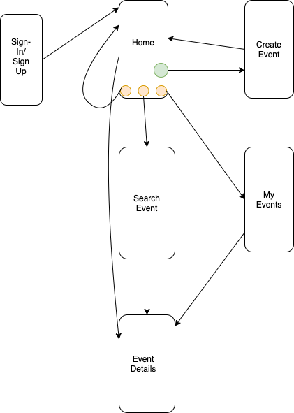
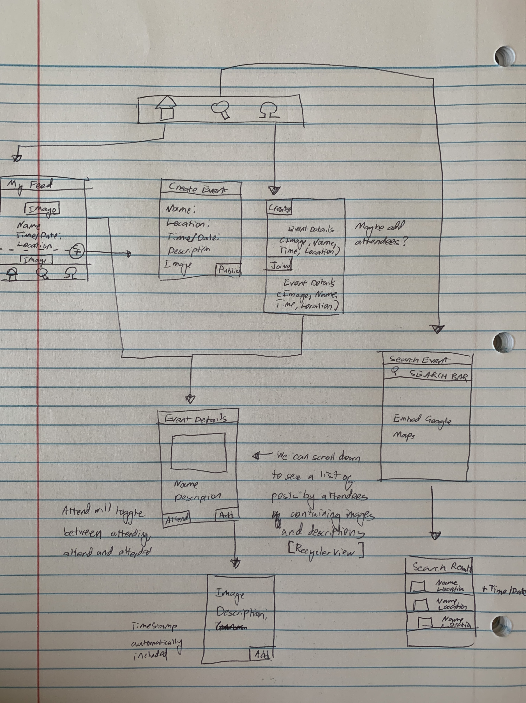
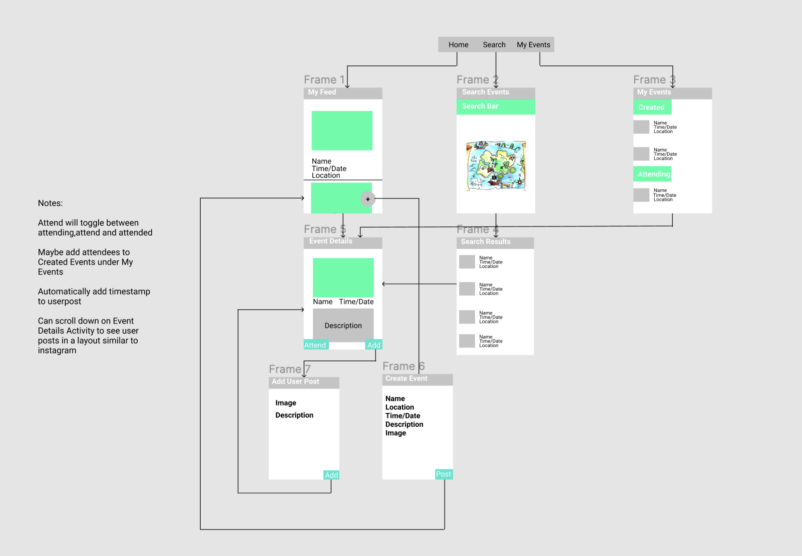

Original App Design Project - README Template
===

# Change the World

## Table of Contents
1. [Overview](#Overview)
1. [Product Spec](#Product-Spec)
1. [Wireframes](#Wireframes)
2. [Schema](#Schema)

## Overview
### Description
Change the World is a take on Facebook Events and is an app that allows users to create philanthropic projects/events and participate in other events near their area

### App Evaluation
- **Category:** Lifestyle
- **Mobile:** Uses camera, push notifications, location and maps
- **Story:** Allows philanthropy to be more accessible to users. This app would appeal to those eager to make a change in their area but find it tedious to either search for events and organize
- **Market:** Anyone who wants to find an effective way to carry out and participate in philanthropic activities
- **Habit:** This would not be a habit-forming app but more of a notification app and an assistant to finding events (an event manager but narrowed down to philanthropy)

## Product Spec

### 1. User Stories (Required and Optional)

**Required Must-have Stories**

* User can sign-in or sign-up
* User can view details about an event
* User can create an event
* User can have a feed of their upcoming events or events near them
* User can search for events
* User can view map to see their location and locations of events near them
* User can 'join' events
* Notifications for events happening in your area

**Optional Nice-to-have Stories**

* Embed GoFundMes or other donation site links and show progress on Event Details page
* Profile page of user which shows details of events attended and created, assigned points to each user and images posted in a Twitter timeline fashion
* Users can edit their event in a "Manage my Event" page
* Settings archetype where you can edit your preferences
* Preferences Page
    * If the previous page is a sign-up page, then this would be the second screen
    * Page where you select tags that interest you
    * Tags would be within empty bubbles that fill up with color when you click

### 2. Screen Archetypes

* Sign-in/Sign-up Screen
   * User can sign-in or sign-up
* Homepage
   * User can have a feed of their upcoming events or events near them
* Create Event
    * User can create an event which would be added to their homepage
* Event Details
    * User can indicate whether they will participate in the event
* Search Event
    * User can find an event
    * User can view details about an event
    * User can indicate whether they will participate in the event
    * User can view map to see their location and locations of events near them

### 3. Navigation

**Tab Navigation** (Tab to Screen)

* Home
* Explore/Search
* My Events (Created and "joined")

**Flow Navigation** (Screen to Screen)

* Home
   * Floating Action Button to Create Event
   * Event Details
* Login/Registration
   * Home
* Create Event
   * Home
* Search Event
    * Event Details
* My Events
   * Event Details

## Wireframes



### [BONUS] Digital Wireframes & Mockups



### [BONUS] Interactive Prototype

## Schema 
### Models
#### Post
   | Property      | Type     | Description |
   | ------------- | -------- | ------------|
   | objectId      | String   | unique id for the user post (default field) |
   | author        | Pointer to User| post author |
   | image         | File     | image that user posts |
   | description       | String   | image description by author |
   | cheerers    | Array of users   | array of users who cheered for the post |
   | createdAt     | DateTime | date when post is created (default field) |
   | eventId     | Pointer to Event | unique id for the user event|
   
#### Event
   | Property      | Type     | Description |
   | ------------- | -------- | ------------|
   | eventId      | String   | unique id for the event (default field) |
   | organizer        | Pointer to User| event organizer |
   | image         | File     | image that organizer adds |
   | description       | String   | image description by organizer |
   | dateAndTime     | DateTime | date when the event takes place|
   | location     | GeoPoint | location where the event takes place|
   | attendees  | Array of pointers to users | Array of the users who are attending the event  |
   
### Networking
- signup function that signs user up
   ```swift {
           ParseUser user = new ParseUser();
           user.setUsername(username);
           user.setPassword(password);
           user.signUpInBackground(new SignUpCallback())}
- login function that logs user in
   ```swift
            ParseUser.logInInBackground(username, password, new LogInCallback() 
- get function that returns events with a keyword that the user searched
   ```swift {
           ParseQuery<Event> query = ParseQuery.getQuery(Event.class);
           query.whereContains(Event.KEY_DESCRIPTION, keyword);
           query.setLimit(20);
           query.addDescendingOrder(Event.KEY_DATE_TIME);
           query.findInBackground() 
- post function that adds a user's post underneath an event
   ```swift {
           Post post = new Post();
           post.setDescription(description);
           post.setImage(new ParseFile(photoFile));
           post.setUser(ParseUser.getCurrentUser);
           post.saveInBackground() 
- post function that adds a user's event
   ```swift {
           Event event = new Event();
           event.setDescription(description);
           event.setImage(new ParseFile(photoFile)); //if available
           event.setOrganizer(ParseUser.getCurrentUser);
           event.setDateandTime(DateTime);
           event.saveInBackground()
- get function that returns events that a user RSVPed
- post that adds user to attendee list
- get function that returns events close to the user
```swift {
           ParseQuery<Event> query = ParseQuery.getQuery(Event.class);
           query.whereContains(Event.KEY_DESCRIPTION, keyword);
           query.setLimit(20);
           query.whereWithinKilometers(Event.KEY_LOCATION,100);
           query.addDescendingOrder(Event.KEY_DATE_TIME);
           query.findInBackground();
